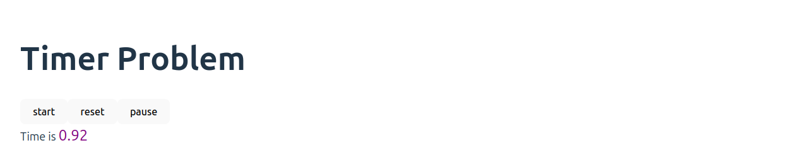
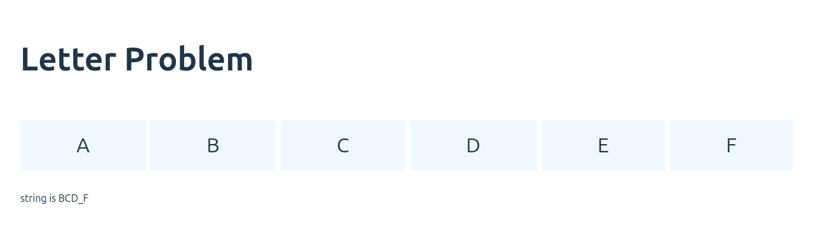

# React Workshop

here is basic react boilerplate based on Vite and adding few interview questions which has been asked in various companies.

## Timer Problem

need to create a page with 3 button start | pause | reset and when user click on start it will start showing time and increase by 100 millisecond and when pause it will pause, and reset will reset the timer.
 time will increase 0.00 to 0.01 --> 0.02 --> 0.03

  

## Letter Print Problem

there are few letter div and when user click on a div , it will print that letter below the div and user keep clicking then string will be added; but if user click a letter 3 times consecutively then it will be convert into `_` --> asked in Apollo

for eg. if I click A B C D ( in same order) --> ABCD will be printed

the if I click E E E ( 3 times) --> `ABCD_` will be printed

if 6 times consecutively then  double underscore `__`

